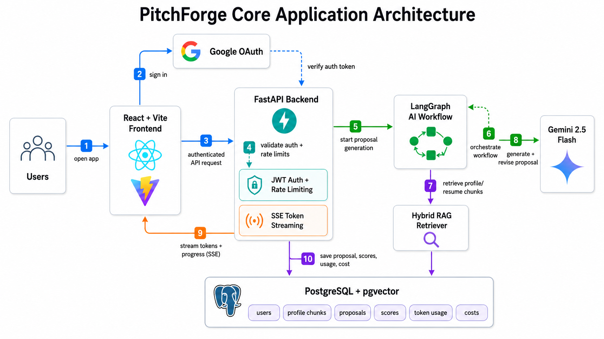
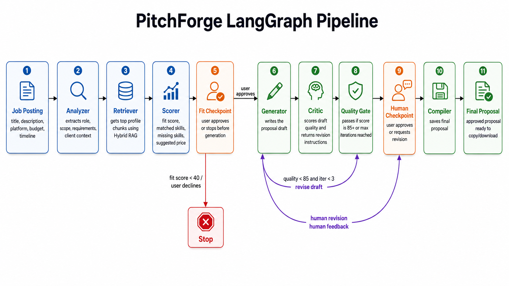
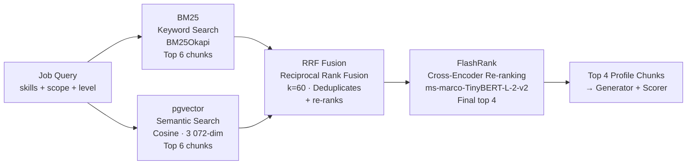
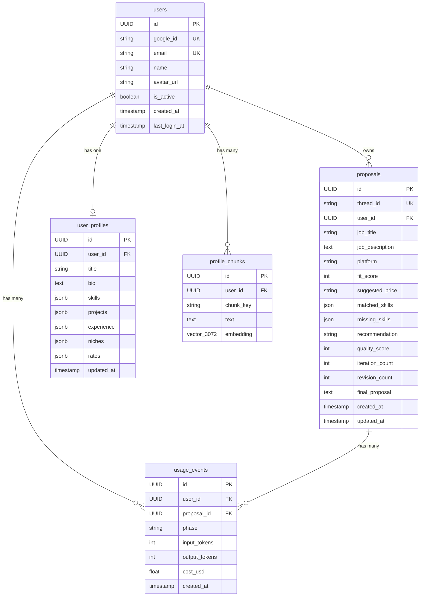
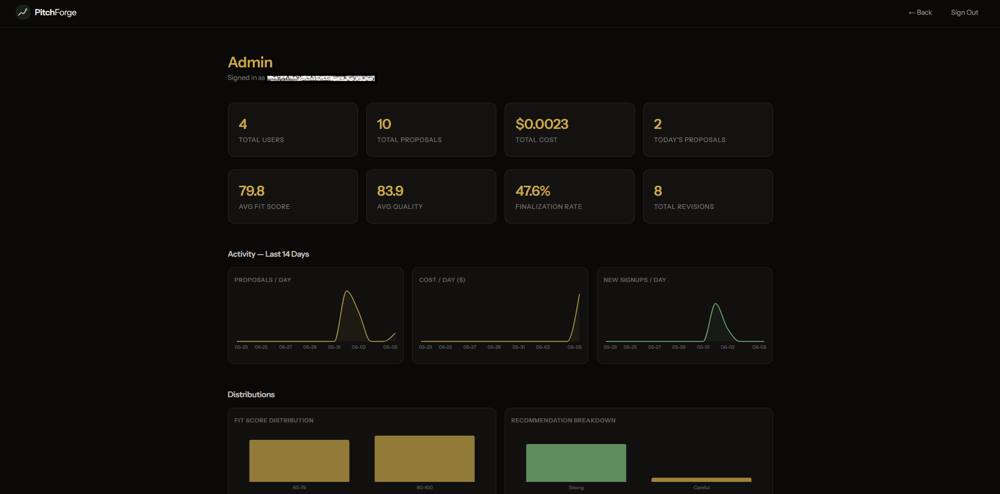
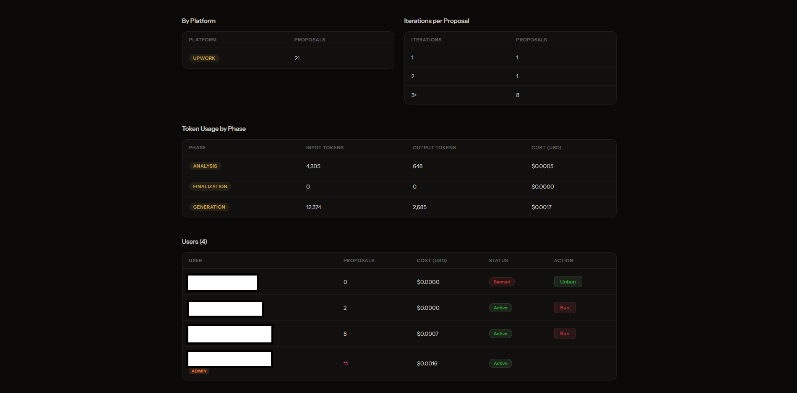
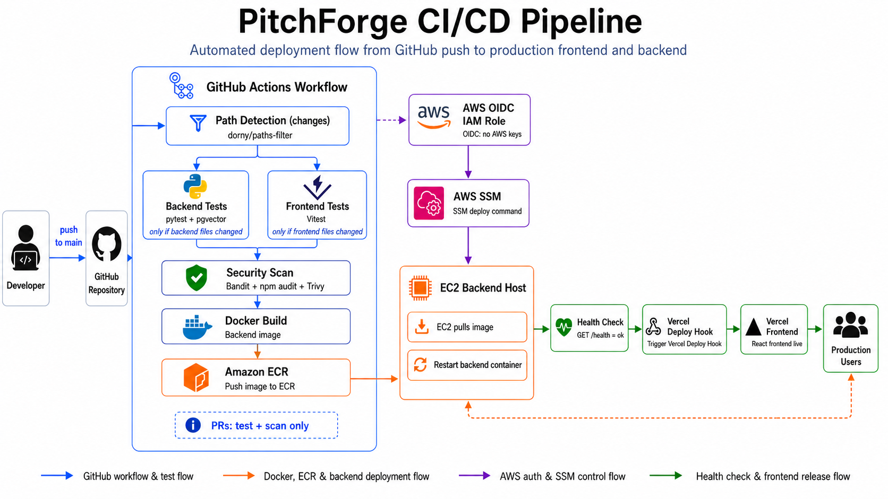
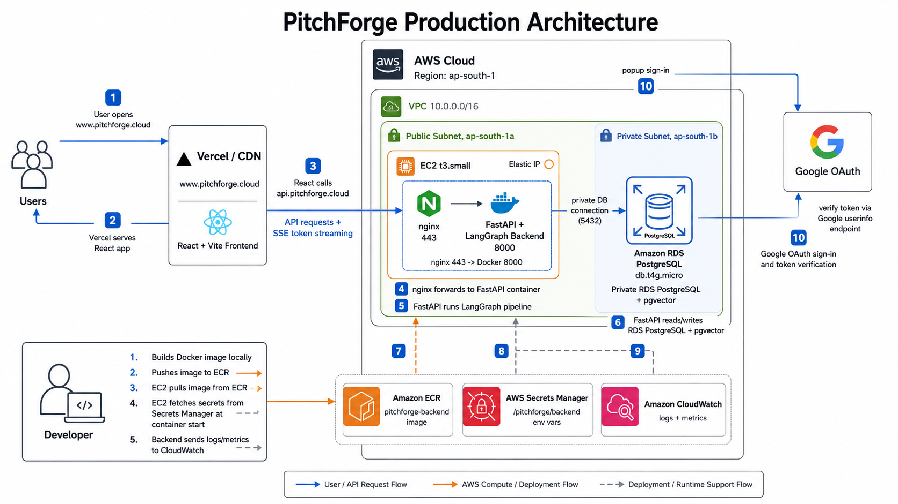
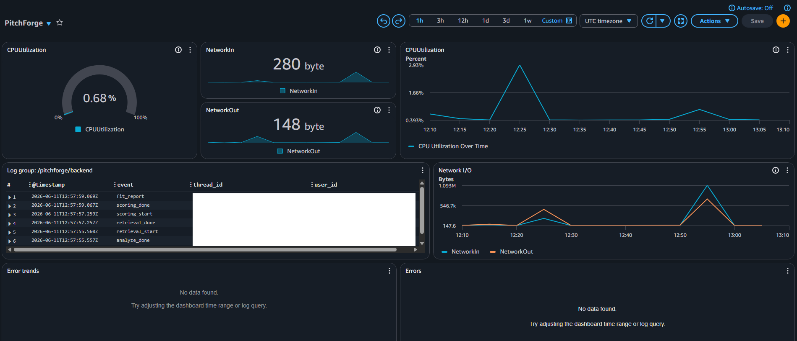

<div align="center">


<br/><br/>


<br/>


<br/>


**Production-grade AI proposal intelligence platform built with LangGraph, hybrid RAG, PostgreSQL/pgvector, AWS, CI/CD, and CloudWatch observability.**

</div>

---

## What is PitchForge

PitchForge is a production-deployed AI system for generating evidence-backed freelance proposals. The product use case is proposal writing; the engineering focus is AI orchestration, retrieval, streaming UX, secure multi-user backend design, and real cloud operations.

Given a job posting, PitchForge scores user-job fit against the user's saved profile using hybrid RAG, runs a LangGraph generate → critique loop until the draft clears an 85/100 quality threshold, streams progress and tokens to the frontend over SSE, and persists the final approved proposal with token usage, cost, and quality metadata.

The system is deployed end to end: Vercel frontend, FastAPI backend on EC2 behind nginx, private RDS PostgreSQL with pgvector, AWS Secrets Manager, ECR, GitHub Actions CI/CD through OIDC + SSM, and CloudWatch logs, dashboards, and alarms.

This is not a prompt wrapper. The core is a stateful AI workflow with human checkpoints, profile-scoped retrieval, prompt-injection guardrails, rate limits, admin observability, usage economics, and production deployment automation.

---

## Live Demo

<div align="center">

[](https://youtu.be/a-EiW3MEHIw)

[](https://youtu.be/a-EiW3MEHIw)

</div>

---

**Live URLs**

| Surface | URL | Notes |
|---------|-----|-------|
| Web app | [https://www.pitchforge.cloud](https://www.pitchforge.cloud) | Production frontend on Vercel |
| API health | [https://api.pitchforge.cloud/health](https://api.pitchforge.cloud/health) | Checks FastAPI, PostgreSQL, and pgvector |

The frontend and backend are deployed separately: Vercel serves the React app, while the API runs behind nginx on an EC2 instance and talks to a private RDS PostgreSQL database.

---

## Table of Contents

- [Live Demo](#live-demo)
- [Architecture](#architecture)
- [The LangGraph Pipeline](#the-langgraph-pipeline)
  - [Node Reference](#node-reference)
  - [State Schema](#state-schema)
  - [Generator: Writing Rules](#generator-writing-rules)
  - [Critic: Scoring Rubric](#critic-scoring-rubric)
- [Hybrid RAG: Profile Retrieval](#hybrid-rag-profile-retrieval)
- [Database](#database)
- [Frontend](#frontend)
- [Admin Panel](#admin-panel)
- [API Reference](#api-reference)
  - [Endpoints](#endpoints)
  - [SSE Event Stream](#sse-event-stream)
  - [Middleware](#middleware)
- [Security](#security)
  - [Security Layers](#security-layers)
  - [Rate Limiting](#rate-limiting)
- [Getting Started](#getting-started)
- [Testing](#testing)
- [DevOps Status](#devops-status)
- [Deployment](#deployment)
  - [CI/CD — GitHub Actions](#cicd--github-actions)
  - [Frontend — Vercel](#frontend--vercel)
  - [DNS — Namecheap](#dns--namecheap)
  - [Docker](#docker)
  - [AWS](#aws)
    - [Compute — EC2](#compute--ec2)
    - [Networking — VPC](#networking--vpc)
    - [Container Registry — ECR](#container-registry--ecr)
    - [Secrets — AWS Secrets Manager](#secrets--aws-secrets-manager)
    - [Database — RDS](#database--rds)
    - [Observability — CloudWatch](#observability--cloudwatch)
    - [Alarms — CloudWatch](#alarms--cloudwatch)
- [Token Economics](#token-economics)

---

## Architecture



Three independent layers. The frontend never sees raw graph state. The backend never calls the graph directly — only `runner.py` does. The database is the single source of truth for application state, vector embeddings, and graph checkpoints.

| Layer | Tech |
|-------|------|
| Orchestration | LangGraph |
| LLM | Gemini 2.5 Flash (`thinking_budget=0` on all nodes) |
| Embeddings | `gemini-embedding-2-preview` — 3072-dim |
| Vector store | pgvector — `profile_chunks` table |
| Retrieval | Hybrid BM25 + pgvector → RRF fusion → FlashRank re-ranking |
| LLM wrapper | LangChain Google GenAI |
| Database | PostgreSQL + pgvector (Docker locally, RDS in production) |
| ORM | SQLAlchemy 2.0 async + asyncpg |
| Graph checkpointer | `langgraph-checkpoint-postgres` (`AsyncPostgresSaver`) |
| Migrations | Alembic |
| Backend | FastAPI |
| Frontend | React 18 + Vite |
| Deps | uv (Python), npm (JS) |

---

## The LangGraph Pipeline

Eight nodes. Two human interrupts. One generate → critique loop.



### Node Reference

| Node | Role | Config |
|------|------|--------|
| **Analyzer** | Parses job posting → structured JSON (title, skills, scope, budget, timeline, client type) | `max_tokens=400` · JSON output |
| **Retriever** | Hybrid RAG — top-4 profile chunks per job query | Async · BM25 + pgvector + RRF + FlashRank |
| **Scorer** | Classifies skills (Required/Preferred/Implicit), scores fit 0–100, suggests evidence-based pricing | `max_tokens=600` · JSON output |
| **Fit Checkpoint** | Interrupts graph — presents score + price to user | No LLM · `langgraph.types.interrupt()` |
| **Generator** | Writes proposal in enforced 5-part structure | `max_tokens=700` · streaming enabled |
| **Critic** | Scores 5 components × 20 pts, quotes weak phrases, returns actionable fix instructions | `max_tokens=800` · JSON output · no profile chunks passed |
| **Human Checkpoint** | Presents proposal — approve or type revision feedback | No LLM · `langgraph.types.interrupt()` |
| **Compiler** | Promotes `proposal_draft` → `final_proposal`, exits | Pure function |

> All LLM nodes: `thinking_budget=0` · `gemini-2.5-flash` · 3-attempt retry on `ServerError` with exponential jitter

### State Schema

Every node reads from and writes to a single shared `TypedDict`. Nodes return only the keys they write.

```python
class PitchforgeState(TypedDict):
    # ── Input ─────────────────────────────────────────────────────
    job_posting: str
    user_id: str              # injected at request start; scopes RAG to this user

    # ── Analysis phase (Analyzer → Scorer) ────────────────────────
    job_analysis: dict        # {title, skills_required, scope, budget, timeline,
                              #  client_type, experience_level, client_identifiable}
    profile_matches: list     # top-4 chunks from hybrid RAG
    fit_score: int            # 0–100
    suggested_price: str      # e.g. "$2,500 fixed"
    matched_skills: list      # Required/Implicit skills confirmed in profile
    missing_skills: list      # Required/Implicit skills absent from profile

    # ── Generation loop (Generator ⇄ Critic) ──────────────────────
    proposal_draft: str
    critic_feedback: str
    iteration_count: int      # 0 → max 3 auto-iterations
    quality_score: int        # 0–100; ≥85 exits loop

    clarifying_questions: list # questions the Analyzer surfaces about the job

    # ── Human checkpoints ─────────────────────────────────────────
    should_apply: bool        # set at fit_checkpoint interrupt
    human_approved: bool      # set at human_checkpoint interrupt
    human_feedback: str       # revision instructions typed by user
    is_human_revision: bool   # True → critic routes direct to human_checkpoint

    # ── Output ────────────────────────────────────────────────────
    final_proposal: str       # promoted from proposal_draft by Compiler
    client_info: Optional[str]
```

### Generator: Writing Rules

Five required parts — no headers, plain paragraphs, 200–300 words:

| Part | Constraint |
|------|-----------|
| **Hook** | The hardest or most overlooked aspect of the job. Not the obvious one. |
| **Proof** | A real project from the profile with specific tech and a concrete outcome. |
| **Approach** | How to build *this specific thing*, referencing their stack, one non-obvious insight. |
| **Question** | One question answerable only by someone who actually thought about the situation. |
| **Closing** | Price + timeline directly. Concrete next step. No filler. |

Profile fidelity is non-negotiable. Every skill and project reference must exist in the retrieved chunks. Missing skills are either omitted or bridged using a specific adjacent tool — never fabricated.

**Banned phrases** (automatic penalty per occurrence): *"robust"*, *"seamlessly"*, *"proven track record"*, *"I am passionate about"*, *"look no further"*, *"I would love to"*, and 8 others.

### Critic: Scoring Rubric

| Component | Max | Fails when |
|-----------|:---:|-----------|
| Hook | 20 | Generic observation; first word is "I" |
| Evidence | 20 | No real project named; tech is vague |
| Approach | 20 | Generic methodology; ignores the client's stack |
| Honesty | 20 | Claims a skill absent from `matched_skills` → automatic **−20** |
| Closing | 20 | Price apologized for; no clear CTA; weak question |

**Pass threshold:** ≥ 85 / 100. At iteration 3, a score ≥ 65 force-exits the loop to prevent stalling on marginal proposals.

---

## Hybrid RAG: Profile Retrieval

Four stages. Every proposal draws from the 4 most relevant slices of your profile — not the whole thing.



- **BM25** catches exact skill-name matches that semantics misses (`asyncpg` vs "async database")
- **pgvector** catches conceptual overlap ("infrastructure automation" → Docker + CI chunks)
- **RRF** merges both ranked lists without score normalization
- **FlashRank** cross-encoder is the final arbiter — full pairwise relevance comparison

**Chunking:** one chunk per project, one per experience entry, shared chunks for bio / skills / niches / rates. Embedded with `gemini-embedding-2-preview` (3072-dim). Per-user isolation via `WHERE user_id = $1`. BM25 corpus cached per-user, invalidated on every profile save.

---

## Database

Four application tables. All schema changes go through Alembic migrations. LangGraph checkpoint tables (`checkpoints`, `checkpoint_blobs`, `checkpoint_writes`) are self-managed by LangGraph and not tracked by Alembic. `proposals.thread_id` bridges each row to the graph checkpoint store — graph state survives backend restarts.



The `Proposal` row is written in two phases: created at `/analyze` with fit data, updated at `/finalize` with the approved proposal text and scores.

---

## Frontend

**Stack:** React 18 + Vite · React Router v6 · `Instrument Sans` · Pure CSS glass-morphism · `@react-oauth/google`

### Pages

| Route | Page | Protected | Description |
|-------|------|:---------:|------------|
| `/` | Landing | — | Hero · Google sign-in · "How It Works" · usage stats in avatar dropdown |
| `/new` | Job Details | ✓ | Job form — title, description, platform, level, budget, timeline. Redirects to profile onboarding if no profile saved. |
| `/analyze` | Analyze Pipeline | ✓ | Live node animation · fit score meter + matched / missing skills |
| `/generate` | Generate Proposal | ✓ | Token-streaming draft · approve / revise loop · revision counter `(n/2)` |
| `/proposals` | Proposal History | ✓ | Card grid · fit + quality score badges · relative timestamps · per-card delete |
| `/proposals/:id` | Proposal Detail | ✓ | Scores strip · skills columns · formatted proposal · copy / download / delete |
| `/profile` | Profile View | ✓ | Structured profile display — title, bio, skills, projects, niches, rates |
| `/profile/edit` | Profile Form | ✓ | Full editor with resume drag-drop autofill · onboarding mode |
| `/admin` | Admin Panel | ✓ (admin only) | Platform metrics · activity charts · token usage · user management |

### UX Highlights

- Pipeline nodes animate idle → pulsing → done as SSE frames arrive
- Circular SVG fit score meter: green ≥ 70 · amber ≥ 40 · red < 40
- Proposal renders word-by-word via token stream
- Revision button disables at limit with live `(2/2)` counter
- Resume drag-drop autofills every profile field via Gemini extraction
- Textareas auto-resize on input and on form pre-fill
- 4.5-second auto-dismiss toasts for copy success · save errors · rate limit hits
- Avatar dropdown: usage progress bar · SVG icons · scale-fade entrance animation

---

## Admin Panel

A single-page dashboard for monitoring the whole platform at a glance. Access requires `is_admin` set directly in the database — the flag is re-checked on every request, so banning an admin takes effect immediately.





**What's observable:**

- **8 stat cards** — total users, proposals, cost, today's activity, avg fit score, avg quality, finalization rate, total revisions
- **14-day activity trends** — proposals/day, cost/day, new signups/day (area charts, zero-filled)
- **Distributions** — fit score histogram (5 buckets) + recommendation breakdown (Strong / Careful / Skip)
- **Breakdowns** — proposal count by platform and by iteration depth (1 / 2 / 3+)
- **Token usage by phase** — input tokens, output tokens, and cost split across Analysis / Generation / Finalization
- **User management** — proposal count and spend per user; one-click ban / unban; self-ban blocked

---

## API Reference

### Endpoints

| Method | Path | Auth | Rate Limit | Purpose |
|--------|------|:----:|:----------:|---------|
| `POST` | `/api/auth/google` | — | 10/hr · IP | Exchange Google token → JWT |
| `GET` | `/api/auth/me` | JWT | — | Current user info |
| `GET` | `/health` | — | — | Real DB + pgvector liveness check (503 when degraded) |
| `POST` | `/api/proposal/analyze` | JWT | 14/day · IP · 7/day · user | Start pipeline, stream fit analysis |
| `POST` | `/api/proposal/generate` | JWT | — | Resume from fit checkpoint |
| `POST` | `/api/proposal/revise` | JWT | — | Resume with human feedback (max 2 revisions) |
| `POST` | `/api/proposal/finalize` | JWT | — | Approve → compile → persist to DB |
| `GET` | `/api/proposals` | JWT | — | All finalized proposals (current user) |
| `GET` | `/api/proposals/{id}` | JWT | — | Single proposal with full detail |
| `DELETE` | `/api/proposals/{id}` | JWT | — | Hard delete · 204 on success |
| `GET` | `/api/usage` | JWT | — | Today's analysis count vs. 7/day limit |
| `GET` | `/api/profile` | JWT | — | Retrieve saved profile |
| `POST` | `/api/profile` | JWT | 8/day · IP · 4/day · user | Save profile + re-embed all chunks |
| `POST` | `/api/profile/parse-resume` | JWT | 4/day · IP · 2/day · user | PDF / DOCX → structured profile JSON |
| `GET` | `/api/admin/stats` | JWT (admin) | — | Aggregate metrics, 14-day time-series, distributions |
| `GET` | `/api/admin/users` | JWT (admin) | — | All users with proposal count + spend |
| `PATCH` | `/api/admin/users/{id}` | JWT (admin) | — | Ban / unban user (`is_active` only) |

### SSE Event Stream

All pipeline endpoints return `text/event-stream`. Every frame is a JSON-encoded event.

| Event | When | Key payload fields |
|-------|------|--------------------|
| `status` | Stream opens — before any node runs | `message` |
| `node_start` | Node begins executing | `node`, `label` |
| `token` | Generator streaming word-by-word | `token` |
| `node_complete` | Node finishes | `node` |
| `interrupt` | Graph paused for human input | `type`, `thread_id`, fit data |
| `done` | Stream complete | result payload |
| `error` | Failure — sanitized message only | `message` |

### Middleware

```
Request → CORS → Security Headers → Rate Limiter → Router → Handler
```

| Layer | Effect |
|-------|--------|
| **CORSMiddleware** | Configurable origins via `CORS_ORIGINS` env var |
| **SecurityHeadersMiddleware** | `X-Frame-Options: DENY` · `X-Content-Type-Options: nosniff` · `Content-Security-Policy: default-src 'none'` |
| **slowapi RateLimiter** | Per-IP + per-user limits on sensitive endpoints |

---

## Security

### Security Layers

| Layer | What it protects | Implementation |
|-------|-----------------|---------------|
| **Prompt Injection Guard** | Job posting + feedback cannot hijack the LLM pipeline | Gemini Flash binary classifier (`max_tokens=10`); 8 attack pattern categories; runs before any graph call |
| **JWT Auth** | All proposal + profile endpoints | HS256 · 7-day expiry · `verify_token()` on every request; `is_active=False` bans immediately |
| **Google OAuth** | Identity verification | `google_id` as stable PK — unaffected if email changes |
| **Thread Ownership** | Users cannot access or modify each other's proposals | `Proposal.user_id == current_user.id` on every graph resume; 403 on mismatch |
| **Atomic Revision Limit** | Race-condition-proof 2-revision cap | `UPDATE ... WHERE revision_count < 2 RETURNING id`; concurrent requests cannot both pass |
| **Input Validation** | Oversized / malformed inputs rejected at boundary | Pydantic v2: `thread_id` ≤ 64 chars; `description` 50–8,000 chars; `skills` ≤ 60 items each ≤ 100 chars |
| **Sanitized Error Messages** | Stack traces never reach clients | `logger.exception()` server-side; generic string only in SSE `error` frame |
| **httpx Auth Timeout** | Hanging Google auth requests | 10s timeout; returns 504 on `TimeoutException` |
| **Security Headers** | Clickjacking · MIME sniffing · script injection | Pure ASGI middleware on every response |
| **LLM 503 Retry** | Upstream Gemini flakiness | 3 attempts · exponential backoff + jitter on all 5 LLM instances |

### Rate Limiting

| Endpoint | IP Limit | User Limit | Notes |
|----------|:--------:|:---------:|-------|
| `/api/proposal/analyze` | 14 / day | 7 / day | User limit counted in DB — survives restarts |
| `/api/auth/google` | 10 / hour | — | Pre-auth; IP only |
| `POST /api/profile` | 8 / day | 4 / day | Re-embedding all chunks is LLM-expensive |
| `POST /api/profile/parse-resume` | 4 / day | 2 / day | One Gemini extraction call per upload |

IP extraction is CDN/proxy-aware: `CF-Connecting-IP` → `X-Real-IP` (nginx) → `X-Forwarded-For` → `request.client.host`. User key extracted from JWT Bearer token — falls back to IP if absent or invalid.

---

## Getting Started

**Prerequisites:** Docker, [uv](https://docs.astral.sh/uv/), Node.js 18+

```bash
# 1 — Start PostgreSQL
docker-compose up -d

# 2 — Apply DB migrations
cd backend && uv run alembic upgrade head

# 3 — Start backend
cd backend && uv run uvicorn app.main:app --reload

# 4 — Start frontend
cd frontend && npm run dev
```

Copy `.env.example` to `.env` and populate your values before starting.

> **First run:** Sign in via Google — you'll be redirected to `/profile/edit` to set up your profile. The pipeline won't start until a profile exists.

---

## Testing

**70 tests total — no mocking of internal business logic, no SQLite shims.**

### Backend (48 tests · pytest + pytest-asyncio)

Runs against a real `pitchforge_test` PostgreSQL database with pgvector. Session-scoped table creation, per-test rollback for isolation, `NullPool` to prevent cross-test connection reuse.

```bash
# Create the test database once
docker exec <postgres-container> psql -U pitchforge -c "CREATE DATABASE pitchforge_test;"
docker exec <postgres-container> psql -U pitchforge -d pitchforge_test -c "CREATE EXTENSION IF NOT EXISTS vector;"

# Run
cd backend && uv run --extra test pytest tests/ -v
```

| Suite | Tests | Covers |
|-------|:-----:|--------|
| `unit/test_jwt_utils` | 4 | Token roundtrip, expiry, tamper detection |
| `unit/test_limiter` | 5 | IP header priority chain, user key from JWT |
| `unit/test_schemas` | 8 | Pydantic validation bounds on all request models |
| `integration/test_auth` | 5 | Google OAuth flow, banned user, `/auth/me` |
| `integration/test_proposals` | 10 | List/get/delete ownership, revision limit (atomic) |
| `integration/test_profile` | 10 | GET 404/200, POST save, parse-resume file validation |
| `integration/test_admin` | 4 | Non-admin 403, stats shape, self-ban, ban/unban |
| `integration/test_health` | 2 | DB up → 200, DB down → 503 |

### Frontend (22 tests · Vitest + React Testing Library)

jsdom environment. `useAuth` mocked via `vi.mock` for component tests. Real `AuthProvider` with mocked `global.fetch` for context tests. No real network calls.

```bash
cd frontend && npm test
```

| Suite | Tests | Covers |
|-------|:-----:|--------|
| `context/AuthContext` | 6 | Session restore, invalid token cleared, login, account_blocked, logout |
| `components/ProtectedRoute` | 3 | Loading suppression, unauthenticated redirect, render children |
| `components/AdminRoute` | 4 | Loading, no user, non-admin redirect, admin renders |
| `pages/JobDetails` | 5 | Profile 404 → onboarding redirect, form validation, valid submit navigates |
| `pages/ProfileForm` | 4 | Wrong file type, file too large, resume pre-fill, API error toast |

---

## DevOps Status

PitchForge is live on a cost-conscious AWS setup designed for learning real production operations without jumping straight to managed orchestration.

| Area | Status | Notes |
|------|:------:|-------|
| Public frontend | Done | Vercel deployment from `frontend/` |
| Public API | Done | EC2 + nginx + HTTPS at `api.pitchforge.cloud` |
| Database isolation | Done | RDS in private subnet; only EC2 security group can reach port 5432 |
| Containerization | Done | Multi-stage Docker image bundling `backend/` + `pitchforge/` |
| Registry | Done | Backend image pushed to ECR and pulled by EC2 |
| Secrets | Done | AWS Secrets Manager; no production `.env` file on host |
| Migrations | Done | `alembic upgrade head` runs at container startup |
| Tests | Done | 48 backend + 22 frontend tests |
| Monitoring | Done | CloudWatch logs, metrics dashboard, and 6 alarms (EC2 + RDS + billing) |
| CI/CD | Done | GitHub Actions: path-filtered changes detection → parallel tests (backend/frontend only when relevant files changed) → security scan → backend deploy → frontend deploy |
| Infrastructure as Code | Next | Terraform for VPC, EC2, RDS, ECR, IAM, and Secrets Manager references |
| Scaling path | Later | ALB, private backend service, ECS/Fargate or autoscaled EC2, Multi-AZ RDS |

Current production posture: suitable for a controlled soft launch with a fully automated deployment pipeline. The next milestone is infrastructure as code.

---

## Deployment

### CI/CD — GitHub Actions

**`.github/workflows/ci-cd.yml` · triggers on every push and PR to `main` (doc-only changes skipped via `paths-ignore`) · path-based skipping: backend and frontend jobs only run when relevant files change**

Every push to `main` runs only the jobs relevant to what changed. Frontend never goes live before the backend is confirmed healthy.



**Jobs:**

| Job | Condition | What it does |
|-----|-----------|-------------|
| `changes` | Always | Uses `dorny/paths-filter@v3` to detect which directories changed. Outputs `backend` bool (`backend/**`, `pitchforge/**`, `Dockerfile`, `.dockerignore`) and `frontend` bool (`frontend/**`). Every downstream job reads these to decide whether to run or skip. |
| `test-backend` | `backend == true` | Spins up `pgvector/pgvector:pg16` service container · installs deps via `uv sync --frozen --extra test` (cached) · runs all 48 pytest tests against a real DB |
| `test-frontend` | `frontend == true` | Installs deps via `npm ci` (cached) · runs all 22 Vitest tests · runs in parallel with `test-backend` |
| `security-scan` | Either side changed; both tests passed or skipped | Uses `always()` so a skipped test job doesn't block it — but bails if a test job actually failed. Bandit (Python SAST) · npm audit · Trivy filesystem CVE scan — Bandit fails on HIGH; npm audit and Trivy fail on CRITICAL. |
| `deploy-backend` | `backend == true` + `security-scan` passed + main push | Authenticates with AWS via OIDC (no stored keys) · builds Docker image · saves current `latest` as `previous` tag (instant rollback) · pushes new image to ECR · sends SSM command to EC2: ECR login → pull → stop+rm old container → restart via `~/run-backend.sh` |
| `deploy-frontend` | `frontend == true` + (`deploy-backend` succeeded or skipped) + main push | Polls `GET /health` every 10s up to 5 min — **only** when backend was also deployed this run (skipped otherwise). Deploys via Vercel CLI (`vercel deploy --prod`). |

**Deploy jobs are gated to `main` push only** via `if: github.ref == 'refs/heads/main' && github.event_name == 'push'` — test and security jobs run on PRs too, deploys never do.

**AWS authentication — OIDC, not access keys**

The IAM role `github-actions-pitchforge` has a trust policy scoped to `repo:hassanabdullahhere/pitchforge:ref:refs/heads/main`. GitHub Actions exchanges a short-lived JWT for 15-minute AWS credentials — no static keys stored anywhere. The role has ECR push permissions and SSM send-command permission scoped to the production EC2 instance.

**Frontend sync guarantee**

Vercel auto-deploy is disabled via an Ignored Build Step (`exit 0`). The `deploy-frontend` job deploys via Vercel CLI only after `/health` returns `"status": "ok"` — guaranteeing the new backend is serving before the new frontend goes live. A breaking API change can never reach users on the old frontend. The CLI approach bypasses the Ignored Build Step entirely (which was found to also cancel deploy-hook-triggered builds).

---

### Frontend — Vercel

**Vercel · deployed only via Vercel CLI from GitHub Actions · root dir: `frontend/`**

- Build: `npm run build` · Output: `dist/`
- `VITE_API_URL=https://api.pitchforge.cloud` set as a Vercel environment variable
- Ignored Build Step set to `exit 0` — git-triggered auto-deploys are disabled; all production deployments are triggered by `vercel deploy --prod` from GitHub Actions after the backend is confirmed healthy
- SPA routing: `vercel.json` catch-all rewrite (`/(.*) → /index.html`) so hard refresh on any React Router route works correctly

**Decision — frontend fetches EC2 directly, not via Vercel rewrites**  
Vercel rewrites buffer the full response before forwarding. SSE token streams would be cut mid-generation. `API_BASE` prefix in `api.js` sends every request straight to EC2, bypassing Vercel entirely.

---

### DNS — Namecheap

**Domain: `pitchforge.cloud` · Registrar: Namecheap**

- `pitchforge.cloud` → 308 permanent redirect → `www.pitchforge.cloud`
- `api.pitchforge.cloud` → A record → EC2 Elastic IP

---

### Docker

**Multi-stage image · `backend/` + `pitchforge/` in one container · entrypoint: `start.sh`**

**Decision — one image, not two services**
`pitchforge/` is a library imported by the backend, not a separate process. Shipping them together eliminates network hops between services, removes version skew risk, and keeps the deployment a single `docker run`.

**Decision — multi-stage build**
- Stage 1 (builder): installs `uv`, runs `uv sync --frozen --no-dev` to build `.venv` inside the image
- Stage 2 (runtime): copies `.venv` + source only — no `uv`, no build tools, no compiler in the final image
- Result: smaller attack surface and a leaner image

**Decision — layer caching on deps**
`pyproject.toml` and `uv.lock` are `COPY`ed before any source code. Docker caches the `uv sync` layer — it only reruns when dependencies actually change. Normal code pushes skip the install entirely.

**Decision — `APP_ENV=production` baked into the image**
`main.py` calls `load_dotenv()` only when `APP_ENV != production`. Baking the flag in at build time means the container never looks for a `.env` file on the host — secrets come exclusively from `-e` flags passed at runtime.

**Decision — `exec uvicorn` in `start.sh`**
`start.sh` runs `alembic upgrade head` (no-op if nothing is new), then calls `exec uvicorn` — not `uvicorn`. `exec` replaces the shell process, so Docker's `SIGTERM` lands directly on uvicorn for a clean graceful shutdown with no zombie shell in between.

---

### AWS



---

#### Compute — EC2

**t3.small · ap-south-1a · Docker runs directly — no ECS or Fargate**

- Elastic IP pinned to the instance — DNS never changes on restart
- nginx on 443 → reverse-proxy to `localhost:8000`; `proxy_buffering off` keeps SSE alive end-to-end
- certbot / Let's Encrypt SSL · auto-renews via systemd timer
- Security group: SSH restricted to your IP only · 80 + 443 open to the world

**Decision — EC2 + Docker directly, not ECS/Fargate**  
ECS adds task definitions, load balancers, and cluster overhead. At this scale one container on one instance is the entire workload — the simpler path has the same operational result.

---

#### Networking — VPC

**10.0.0.0/16 · ap-south-1 · EC2 in public subnet, RDS in private subnet — isolated by design**

```
VPC 10.0.0.0/16  (pitchforge-vpc)
├── Public Subnet  10.0.0.0/20   ap-south-1a  — EC2 + Elastic IP
└── Private Subnet 10.0.144.0/20 ap-south-1b  — RDS (isolated)
```

- RDS port 5432 is open only from `sg-ec2` — never from the internet

**Decision — no NAT Gateway**  
RDS is fully managed by AWS and needs no outbound internet access. Skipping the NAT Gateway eliminates ~$32/month of fixed cost with no operational downside.

---

#### Container Registry — ECR

**ap-south-1 · repo: `pitchforge-backend`**

- GitHub Actions builds and pushes the image on every merge to `main` via OIDC authentication — no manual steps, no stored AWS keys
- Two tags are maintained: `latest` (current production image) and `previous` (the image that was `latest` before this push). The deploy step promotes `latest` → `previous` before overwriting it, so rolling back is a single `docker pull :previous` + restart — no rebuild needed.
- EC2 pulls the new image via SSM command — the instance profile grants ECR pull permissions

**Decision — OIDC for push, instance profile for pull**  
GitHub Actions assumes an IAM role via OIDC (short-lived token, scoped to this repo and branch) to push. EC2 uses its instance profile to pull. No long-lived AWS credentials exist anywhere in the pipeline.

---

#### Secrets — AWS Secrets Manager

**Secret: `/pitchforge/backend` · 7 production env vars · zero plaintext on disk**

Stores: `GEMINI_API_KEY`, `DATABASE_URL`, `JWT_SECRET_KEY`, `GOOGLE_CLIENT_ID`, `CORS_ORIGINS`, `LOG_FORMAT`, `APP_ENV`

- EC2 startup script fetches the secret via AWS SDK and passes each value as a `-e` flag to `docker run` — secrets exist only in memory at runtime
- To rotate any value: update in Secrets Manager → re-run `~/run-backend.sh` on EC2. No image rebuild needed.

---

#### Database — RDS

**db.t4g.micro · PostgreSQL 18 · ap-south-1b · pgvector pre-installed**

- pgvector extension is bundled by AWS — no `CREATE EXTENSION` step needed
- Alembic migrations run automatically at container startup via `start.sh`

**Decision — private subnet + security group, two isolation layers**  
RDS has no public IP. `sg-rds` allows port 5432 from `sg-ec2` only. A misconfigured security group alone cannot expose the database — the subnet placement is a second independent barrier.

---

#### Observability — CloudWatch

**CloudWatch Logs · Log Insights · Custom Dashboard · ap-south-1**

Container stdout is routed to CloudWatch via the Docker `awslogs` log driver. All application events are emitted as structured JSON by `structlog` (`LOG_FORMAT=json`), making every log line directly queryable in Log Insights.



**What the dashboard shows:**

| Widget | Signal | Why it matters |
|--------|--------|---------------|
| CPU Utilization (gauge) | Saturation | Confirms EC2 is not resource-constrained under load |
| Network In / Out (gauge) | Traffic | Real-time bytes in/out — spikes correlate with pipeline runs |
| CPU Over Time (line chart) | Saturation trend | CPU spike at pipeline execution time is visible and expected |
| Network I/O (line chart) | Traffic trend | NetworkIn + NetworkOut on one chart — divergence indicates one-sided issues |
| Error Trend (bar chart) | Errors | Hourly error count from `level = "error"` log lines — empty means healthy |
| Pipeline Activity (table) | Traffic + correctness | Live feed of node events with `thread_id` and `user_id` — confirms the graph is executing correctly end-to-end |

**Decision — structured logs over metric filters**  
The existing `structlog` JSON output (`thread_id`, `user_id`, `event`, `level` on every line) gives full Log Insights queryability with zero code changes. Metric filters were considered but skipped — the admin panel already surfaces business-level metrics (proposals/day, cost, scores), so CloudWatch covers the infrastructure and runtime layer only.

---

#### Alarms — CloudWatch

**6 alarms · SNS email notifications · ap-south-1 (+ us-east-1 for billing)**

| Alarm | Threshold | Why |
|-------|-----------|-----|
| EC2 CPU high | > 80% for 5 min | t3.small burns burst credits fast under sustained load |
| EC2 StatusCheckFailed | ≥ 1 | Catches hung instance or underlying hardware failure |
| RDS CPU high | > 80% for 5 min | db.t4g.micro has limited compute headroom |
| RDS FreeStorageSpace | < 1 GB | Disk full = total outage |
| RDS FreeableMemory | < 100 MB | db.t4g.micro has 1 GB RAM; pgvector + shared_buffers consume ~850 MB normally — 100 MB is the real danger zone |
| Billing EstimatedCharges | > $30 / month | Catches runaway Gemini calls or accidental resource leaks |

All alerts route to an SNS topic subscribed to the operator email. The billing alarm lives in `us-east-1` (AWS requirement); all others are in `ap-south-1`.

---

## Token Economics

Gemini 2.5 Flash · thinking disabled on all nodes.

| Scenario | Estimated cost |
|----------|:--------------:|
| Typical run (2 auto-iterations) | ~$0.0013 |
| Worst case (3 auto + 2 human revisions) | ~$0.0027 |

**Pricing:** $0.075 / 1M input tokens · $0.30 / 1M output tokens

Key savings: `thinking_budget=0` (47× cheaper than thinking mode), per-node output caps, Critic node does not receive profile chunks (~1,800 tokens saved per critique call).

---

<div align="center">
  <sub>Built with care. No shortcuts.</sub>
</div>
