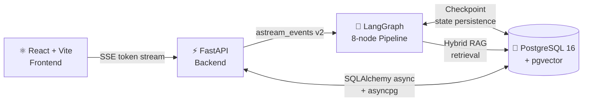
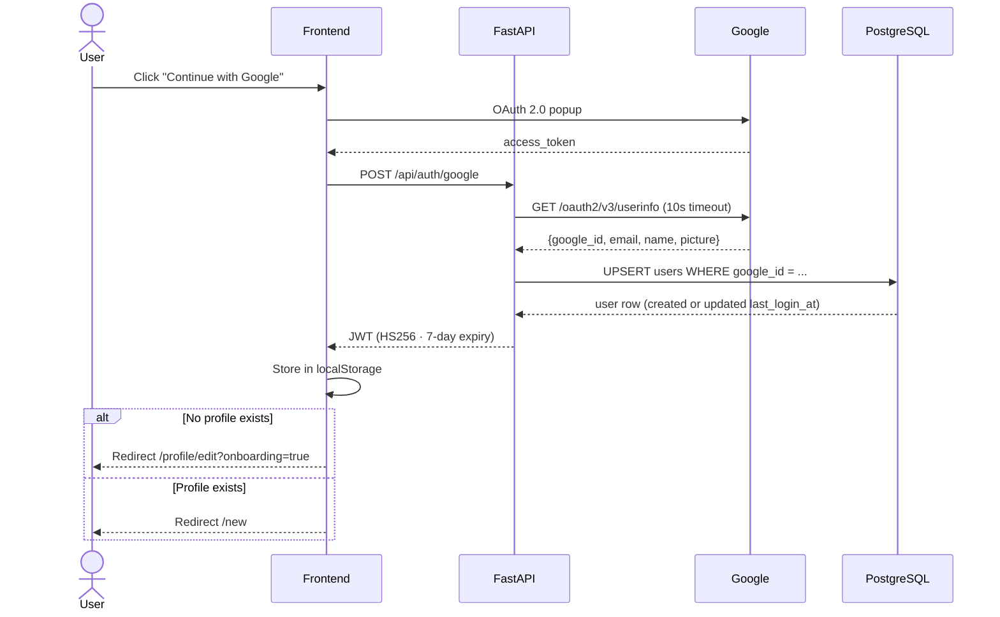
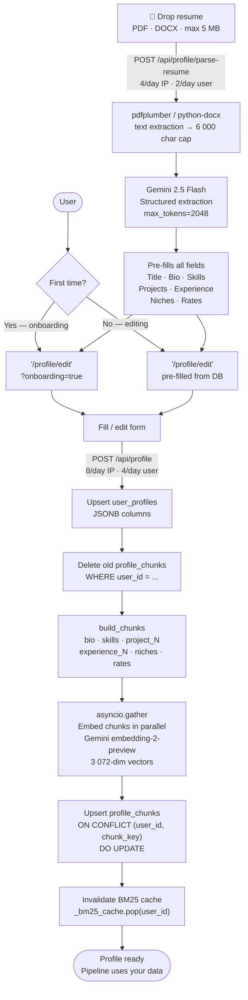
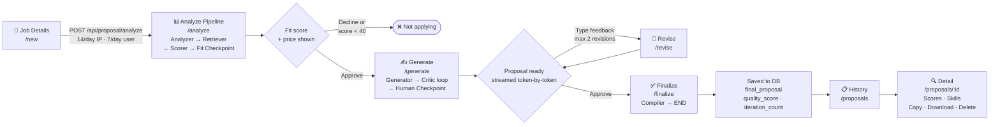
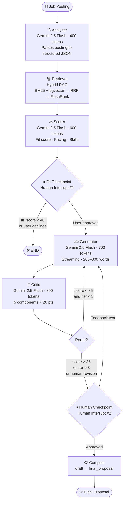
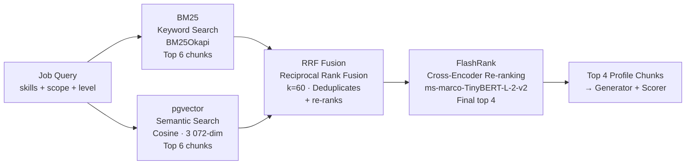
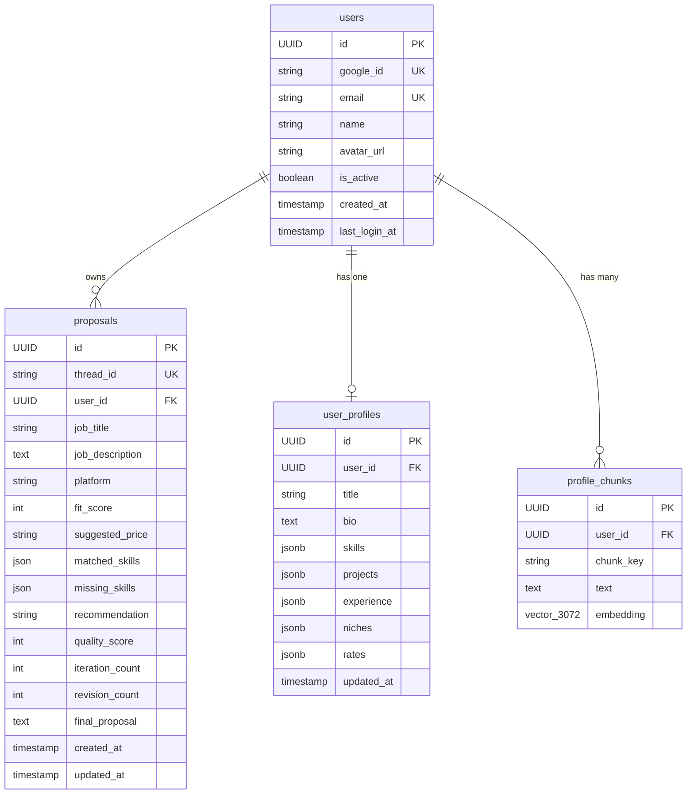

<div align="center">


<br/><br/>


</div>

---

## What is PitchForge

Freelance proposals are lost in the first sentence — or never sent at all. PitchForge takes a raw job posting, scores your fit using hybrid RAG retrieval, and runs an automated generate → critique loop until the proposal clears a quality threshold. Then it hands the result to you for final approval.

Every claim in the output traces back to your actual profile. Every word choice survives a critic that quotes and penalizes AI-slop by name.

---

## Architecture



Three independent layers. The frontend never sees raw graph state. The backend never calls the graph directly — only `runner.py` does. The database is the single source of truth for application state, vector embeddings, and graph checkpoints.

---

## Feature Flows

### Authentication



`google_id` is the stable primary key — email can change without affecting the account. `is_active=False` bans immediately without token invalidation. All subsequent requests include `Authorization: Bearer <jwt>`.

---

### Profile Setup

Every proposal is grounded in your profile. This is the data pipeline that makes that possible.



Profile data is stored as JSONB in `user_profiles`. The embedding pipeline is atomic: old chunks deleted first, new ones embedded in parallel and upserted, BM25 cache invalidated last. No partial states.

---

### Proposal Journey

The full user path from job form to saved proposal.



The `Proposal` row is written in two phases: created at `/analyze` with fit data, updated at `/finalize` with the approved text. The `thread_id` column links the row to the LangGraph checkpoint store — graph state survives backend restarts.

---

## The Engine: LangGraph Pipeline

Eight nodes. Two human interrupts. One generate → critique loop.



### Node Reference

| Node | Role | Config |
|------|------|--------|
| **Analyzer** | Parses job posting → structured JSON (title, skills, scope, budget, timeline, client type) | `max_tokens=400` · JSON output |
| **Retriever** | Hybrid RAG — top-4 profile chunks per job query | Async · BM25 + pgvector + RRF + FlashRank |
| **Scorer** | Classifies skills (Required/Preferred/Implicit), scores fit 0–100, suggests evidence-based pricing | `max_tokens=600` · JSON output |
| **Fit Checkpoint** | Interrupts graph — presents score + price to user | No LLM · `langgraph.types.interrupt()` |
| **Generator** | Writes proposal in enforced 5-part structure | `max_tokens=700` · streaming enabled |
| **Critic** | Scores 5 components × 20 pts, quotes weak phrases, returns actionable fix instructions | `max_tokens=800` · JSON output · **no profile chunks passed** |
| **Human Checkpoint** | Presents proposal — approve or type revision feedback | No LLM · `langgraph.types.interrupt()` |
| **Compiler** | Promotes `proposal_draft` → `final_proposal`, exits | Pure function |

> All LLM nodes: `thinking_budget=0` · `gemini-2.5-flash` · 3-attempt retry on `ServerError` with exponential jitter

### State Schema

Every node reads from and writes to a single shared `TypedDict`. Nodes return only the keys they write — no full-state mutations.

```python
class PitchforgeState(TypedDict):
    # ── Input ─────────────────────────────────────────────────────
    job_posting: str
    user_id: str              # injected at request start; scopes RAG to this user

    # ── Analysis phase (Analyzer → Scorer) ────────────────────────
    job_analysis: dict        # {title, skills_required, scope, budget, timeline,
                              #  client_type, experience_level, client_identifiable}
    profile_matches: list     # top-4 chunks from hybrid RAG
    fit_score: int            # 0–100
    suggested_price: str      # e.g. "$2,500 fixed"
    matched_skills: list      # Required/Implicit skills confirmed in profile
    missing_skills: list      # Required/Implicit skills absent from profile

    # ── Generation loop (Generator ⇄ Critic) ──────────────────────
    proposal_draft: str
    critic_feedback: str
    iteration_count: int      # 0 → max 3 auto-iterations
    quality_score: int        # 0–100; ≥85 exits loop

    # ── Human checkpoints ─────────────────────────────────────────
    should_apply: bool        # set at fit_checkpoint interrupt
    human_approved: bool      # set at human_checkpoint interrupt
    human_feedback: str       # revision instructions typed by user
    is_human_revision: bool   # True → critic routes direct to human_checkpoint

    # ── Output ────────────────────────────────────────────────────
    final_proposal: str       # promoted from proposal_draft by Compiler
    client_info: Optional[str]
```

### Generator: The Writing Rules

Five required parts — no headers, plain paragraphs, 200–300 words:

| Part | Constraint |
|------|-----------|
| **Hook** | The hardest or most overlooked aspect of the job. Not the obvious one. |
| **Proof** | A real project from the profile with specific tech and a concrete outcome. |
| **Approach** | How to build *this specific thing*, referencing their stack, one non-obvious insight. |
| **Question** | One question answerable only by someone who actually thought about the situation. |
| **Closing** | Price + timeline directly. Concrete next step. No filler. |

**Profile fidelity is non-negotiable.** Every skill and project reference must exist in the retrieved chunks. Missing skills are either omitted or bridged using a specific adjacent tool — never fabricated.

**Banned phrases** (automatic penalty per occurrence): *"robust"*, *"seamlessly"*, *"proven track record"*, *"I am passionate about"*, *"look no further"*, *"I would love to"*, and 8 others.

### Critic: Scoring Rubric

| Component | Max | Fails when |
|-----------|:---:|-----------|
| Hook | 20 | Generic observation; first word is "I" |
| Evidence | 20 | No real project named; tech is vague |
| Approach | 20 | Generic methodology; ignores the client's stack |
| Honesty | 20 | Claims a skill absent from `matched_skills` → automatic **−20** |
| Closing | 20 | Price apologized for; no clear CTA; weak question |

**Pass threshold:** ≥ 85 / 100. At iteration 3, a score ≥ 65 force-exits the loop to prevent stalling on marginal proposals.

---

## Hybrid RAG: Profile Retrieval

Four stages. Every proposal draws from the 4 most relevant slices of your profile — not the whole thing.



**Why four stages:**
- BM25 catches exact skill-name matches semantics misses (`asyncpg` vs "async database")
- pgvector catches conceptual overlap ("infrastructure automation" → Docker + CI chunks)
- RRF merges both ranked lists without score normalization
- FlashRank cross-encoder is the final arbiter — full pairwise relevance comparison

**Chunking:** one chunk per project, one per experience entry, shared chunks for bio / skills / niches / rates. Embedded with `gemini-embedding-2-preview` (3072-dim). **Per-user isolation** via `WHERE user_id = $1`. BM25 corpus cached per-user, invalidated on every profile save.

---

## API Layer: FastAPI Backend

### Endpoints

| Method | Path | Auth | Rate Limit | Purpose |
|--------|------|:----:|:----------:|---------|
| `POST` | `/api/auth/google` | — | 10/hr · IP | Exchange Google token → JWT |
| `GET` | `/api/auth/me` | JWT | — | Current user info |
| `GET` | `/health` | — | — | Real DB + pgvector liveness check (503 when degraded) |
| `POST` | `/api/proposal/analyze` | JWT | 14/day · IP · 7/day · user | Start pipeline, stream fit analysis |
| `POST` | `/api/proposal/generate` | JWT | — | Resume from fit checkpoint |
| `POST` | `/api/proposal/revise` | JWT | — | Resume with human feedback (max 2) |
| `POST` | `/api/proposal/finalize` | JWT | — | Approve → compile → persist to DB |
| `GET` | `/api/proposals` | JWT | — | All finalized proposals (current user) |
| `GET` | `/api/proposals/{id}` | JWT | — | Single proposal with full detail |
| `DELETE` | `/api/proposals/{id}` | JWT | — | Hard delete · 204 on success |
| `GET` | `/api/usage` | JWT | — | Today's analysis count vs. 7/day limit |
| `GET` | `/api/profile` | JWT | — | Retrieve saved profile |
| `POST` | `/api/profile` | JWT | 8/day · IP · 4/day · user | Save profile + re-embed all chunks |
| `POST` | `/api/profile/parse-resume` | JWT | 4/day · IP · 2/day · user | PDF / DOCX → structured profile JSON |

### SSE Event Stream

All pipeline endpoints return `text/event-stream`. Every frame is a JSON-encoded event:

| Event | When | Key payload fields |
|-------|------|--------------------|
| `status` | Stream opens — before any node runs | `message` |
| `node_start` | Node begins executing | `node`, `label` |
| `token` | Generator streaming word-by-word | `token` |
| `node_complete` | Node finishes | `node` |
| `interrupt` | Graph paused for human input | `type`, `thread_id`, fit data |
| `done` | Stream complete | result payload |
| `error` | Failure — sanitized message only | `message` |

### Middleware Stack

```
Request → CORS → Security Headers → Rate Limiter → Router → Handler
```

| Layer | Effect |
|-------|--------|
| **CORSMiddleware** | Configurable origins via `CORS_ORIGINS` env var |
| **SecurityHeadersMiddleware** | `X-Frame-Options: DENY` · `X-Content-Type-Options: nosniff` · `Content-Security-Policy: default-src 'none'` |
| **slowapi RateLimiter** | Per-IP + per-user limits on sensitive endpoints |

---

## Database

Four tables. All schema changes through Alembic migrations. LangGraph checkpoint tables (`checkpoints`, `checkpoint_blobs`, `checkpoint_writes`) are self-managed by LangGraph — not tracked by Alembic. `proposals.thread_id` is the bridge: one row per conversation thread, graph state survives backend restarts.



---

## Security

Defense in layers. No single point of trust.

| Layer | What it protects | Implementation |
|-------|-----------------|---------------|
| **Prompt Injection Guard** | Job posting + feedback cannot hijack the LLM pipeline | Gemini Flash binary classifier (`max_tokens=10`); 8 attack pattern categories; runs before any graph call; emits `status` SSE event first so the stream is already open |
| **JWT Auth** | All proposal + profile endpoints | HS256 · 7-day expiry · `verify_token()` on every request; `is_active=False` bans immediately |
| **Google OAuth** | Identity verification | `google_id` as PK — stable even if email changes; Google userinfo endpoint validation |
| **Thread Ownership** | Users cannot access or modify each other's proposals | `Proposal.user_id == current_user.id` on every graph resume; 403 on mismatch |
| **Atomic Revision Limit** | Race-condition-proof 2-revision cap | `UPDATE ... WHERE revision_count < 2 RETURNING id`; concurrent requests cannot both pass |
| **Input Validation** | Oversized / malformed inputs rejected at boundary | Pydantic v2: `thread_id` ≤ 64 chars; `description` 50–8,000 chars; `skills` ≤ 60 items each ≤ 100 chars; `projects` ≤ 20 |
| **Sanitized Error Messages** | Internal stack traces never reach clients | Full exception logged via `logger.exception()`; only a generic string emitted in the `error` SSE frame |
| **httpx Auth Timeout** | Hanging Google auth requests | 10s timeout on Google userinfo call; returns 504 on `TimeoutException` |
| **Security Headers** | Clickjacking · MIME sniffing · script injection | Pure ASGI middleware; applied to every HTTP response |
| **LLM 503 Retry** | Upstream Gemini service flakiness | 3 attempts · exponential backoff + jitter on all 5 LLM instances |

---

## Rate Limiting

Two dimensions: IP-based at the edge, per-user for authenticated actions.

| Endpoint | IP Limit | User Limit | Notes |
|----------|:--------:|:---------:|-------|
| `/api/proposal/analyze` | 14 / day | 7 / day | User limit counted in DB — survives restarts |
| `/api/auth/google` | 10 / hour | — | Pre-auth; IP only |
| `POST /api/profile` | 8 / day | 4 / day | Re-embedding all chunks is LLM-expensive |
| `POST /api/profile/parse-resume` | 4 / day | 2 / day | One Gemini extraction call per upload |

**IP extraction** is CDN/proxy-aware: `CF-Connecting-IP` → `X-Real-IP` (nginx) → `X-Forwarded-For` (first hop) → `request.client.host`. **User key** extracted from JWT Bearer token — falls back to IP if token is absent or invalid.

---

## Observability

Structured logging via `structlog` — configured once at FastAPI startup in `pitchforge/logging_config.py`.

| Mode | Output | How to activate |
|------|--------|----------------|
| Development | Pretty colored console | `LOG_FORMAT=pretty` (default) |
| Production | JSON lines — CloudWatch / Datadog / any aggregator | `LOG_FORMAT=json` |

**Context propagation:** `thread_id` and `user_id` are bound as structlog context variables at the start of every streaming request in `runner.py`. Every log line from every pipeline node in that request automatically carries both fields — no manual passing required.

| Level | What's logged |
|-------|--------------|
| `info` | Node start / complete, pipeline milestones |
| `debug` | Token usage per LLM call (input + output tokens) |
| `warning` | JSON parse failures, unexpected node output shapes |

---

## Frontend

Eight pages. Full auth flow. Real-time SSE throughout.

| Route | Page | Protected | Description |
|-------|------|:---------:|------------|
| `/` | Landing | — | Hero · Google sign-in · "How It Works" · usage stats in avatar dropdown |
| `/new` | Job Details | ✓ | Job form — title, description, platform, level, budget, timeline. Redirects to profile onboarding if no profile saved. |
| `/analyze` | Analyze Pipeline | ✓ | Live node animation · fit score meter + matched / missing skills |
| `/generate` | Generate Proposal | ✓ | Token-streaming draft · approve / revise loop · revision counter `(n/2)` |
| `/proposals` | Proposal History | ✓ | Card grid · fit + quality score badges · relative timestamps · per-card delete |
| `/proposals/:id` | Proposal Detail | ✓ | Scores strip · skills columns · formatted proposal · copy / download / delete |
| `/profile` | Profile View | ✓ | Structured profile display — title, bio, skills, projects, niches, rates |
| `/profile/edit` | Profile Form | ✓ | Full editor with resume drag-drop autofill · onboarding mode |

**Stack:** React 18 + Vite · React Router v6 · `Instrument Sans` · Pure CSS glass-morphism · `@react-oauth/google`

**UX highlights:**
- Pipeline nodes animate idle → pulsing → done as SSE frames arrive
- Circular SVG fit score meter: green ≥ 70 · amber ≥ 40 · red < 40
- Proposal renders word-by-word via token stream
- Revision button disables at limit with live `(2/2)` counter
- Resume drag-drop autofills every profile field via Gemini extraction
- Textareas auto-resize on input and on form pre-fill
- 4.5-second auto-dismiss toasts for copy success · save errors · rate limit hits
- Avatar dropdown: usage progress bar · SVG icons · scale-fade entrance animation

---

## Getting Started

```bash
# 1 — PostgreSQL
docker-compose up -d

# 2 — Apply migrations
cd backend && uv run alembic upgrade head

# 3 — Backend
cd backend && uv run uvicorn app.main:app --reload

# 4 — Frontend
cd frontend && npm run dev
```

**Environment files:**

| File | Variables |
|------|-----------|
| `.env` (root) | `DB_USER`, `DB_PASSWORD`, `DB_NAME`, `DB_PORT` |
| `backend/.env` | `GEMINI_API_KEY`, `DATABASE_URL`, `CORS_ORIGINS`, `JWT_SECRET_KEY`, `GOOGLE_CLIENT_ID` |
| `pitchforge/.env` | `GEMINI_API_KEY`, `DATABASE_URL_SYNC` |
| `frontend/.env` | `VITE_GOOGLE_CLIENT_ID` |

Seed your profile chunks after first setup:

```bash
cd pitchforge && uv run python setup_rag.py <your_user_uuid>
```

---

## Token Economics

Gemini 2.5 Flash · thinking disabled on all nodes.

| Scenario | Estimated cost |
|----------|:-------------:|
| Typical run (2 auto-iterations) | ~$0.0013 |
| Worst case (3 auto + 2 human revisions) | ~$0.0027 |

**Pricing:** $0.075 / 1M input tokens · $0.30 / 1M output tokens

Key savings: `thinking_budget=0` (47× cheaper than thinking mode), per-node output caps, Critic node does not receive profile chunks (~1,800 tokens saved per critique call).

---

## Deployment

> **Coming soon** — Docker + AWS deployment guide in progress.

---

<div align="center">
  <sub>Built with care. No shortcuts.</sub>
</div>
