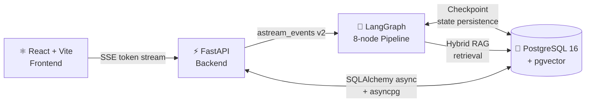

<div align="center">


<br/><br/>


</div>

---

## What is PitchForge

Most freelance proposals get ignored. Not because the freelancer is underqualified — because the proposal reads like everyone else's.

PitchForge takes a job posting, scores your fit against your actual profile using hybrid RAG retrieval, and runs an automated generate → critique loop until the proposal clears an 85/100 quality threshold. Then it hands the result to you for final approval.

Every skill claim traces back to your retrieved profile. Every AI-slop phrase gets penalized by name.

---

## Architecture



Three independent layers. The frontend never sees raw graph state. The backend never calls the graph directly — only `runner.py` does. The database is the single source of truth for application state, vector embeddings, and graph checkpoints.

---

## Getting Started

**Prerequisites:** Docker, [uv](https://docs.astral.sh/uv/), Node.js 18+

```bash
# 1 — Start PostgreSQL
docker-compose up -d

# 2 — Apply DB migrations
cd backend && uv run alembic upgrade head

# 3 — Start backend
cd backend && uv run uvicorn app.main:app --reload

# 4 — Start frontend
cd frontend && npm run dev
```

Copy `.env.example` to `.env` and fill in your values. See [Deployment](docs/deployment.md) for the full environment variable reference.

> **First run:** Sign in via Google, then go to `/profile/edit` to set up your profile. The pipeline will redirect you there automatically if no profile exists.

> **Optional — legacy dev seed:** To seed profile chunks from a JSON file instead of the UI, run `cd pitchforge && uv run python setup_rag.py <your_user_uuid>`. Get your UUID from `GET /api/auth/me` after signing in.

---

## Token Economics

Gemini 2.5 Flash · thinking disabled on all nodes.

| Scenario | Estimated cost |
|----------|:--------------:|
| Typical run (2 auto-iterations) | ~$0.0013 |
| Worst case (3 auto + 2 human revisions) | ~$0.0027 |

**Pricing:** $0.075 / 1M input tokens · $0.30 / 1M output tokens

Key savings: `thinking_budget=0` (47× cheaper than thinking mode), per-node output caps, Critic node does not receive profile chunks (~1,800 tokens saved per critique call).

---

## Go Deeper

| Topic | Doc |
|-------|-----|
| LangGraph pipeline, state schema, RAG, node reference | [Architecture](docs/architecture.md) |
| API endpoints, SSE event stream, middleware | [API](docs/api.md) |
| Security layers, rate limiting, input validation | [Security](docs/security.md) |
| Frontend routes, UX, component overview | [Frontend](docs/frontend.md) |
| Environment variables, production checklist | [Deployment](docs/deployment.md) |

---

<div align="center">
  <sub>Built with care. No shortcuts.</sub>
</div>
