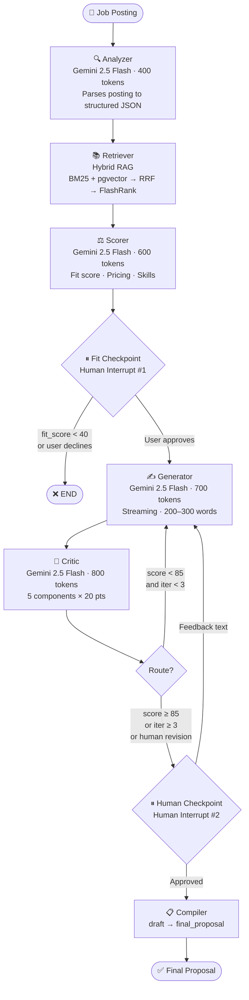
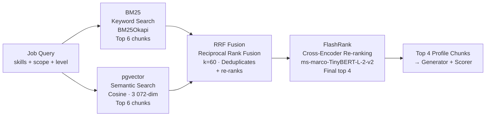
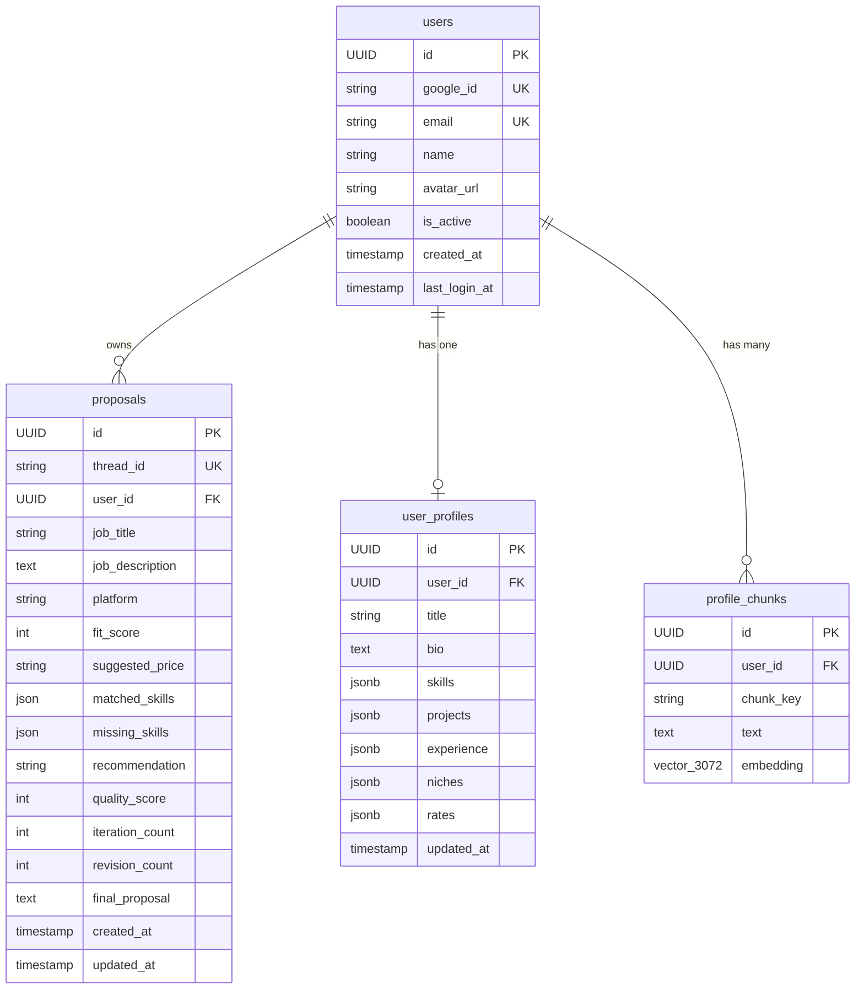

# Architecture

## Stack

| Layer | Tech |
|-------|------|
| Orchestration | LangGraph |
| LLM | Gemini 2.5 Flash (`thinking_budget=0` on all nodes) |
| Embeddings | `gemini-embedding-2-preview` — 3072-dim |
| Vector store | pgvector — `profile_chunks` table |
| Retrieval | Hybrid BM25 + pgvector → RRF fusion → FlashRank re-ranking |
| LLM wrapper | LangChain Google GenAI |
| Database | PostgreSQL 16 via Docker (`pgvector/pgvector:pg16`) |
| ORM | SQLAlchemy 2.0 async + asyncpg |
| Graph checkpointer | `langgraph-checkpoint-postgres` (`AsyncPostgresSaver`) — psycopg3 pool |
| Migrations | Alembic |
| Backend | FastAPI |
| Frontend | React 18 + Vite |
| Deps | uv (Python), npm (JS) |

---

## LangGraph Pipeline

Eight nodes. Two human interrupts. One generate → critique loop.



### Node Reference

| Node | Role | Config |
|------|------|--------|
| **Analyzer** | Parses job posting → structured JSON (title, skills, scope, budget, timeline, client type) | `max_tokens=400` · JSON output |
| **Retriever** | Hybrid RAG — top-4 profile chunks per job query | Async · BM25 + pgvector + RRF + FlashRank |
| **Scorer** | Classifies skills (Required/Preferred/Implicit), scores fit 0–100, suggests evidence-based pricing | `max_tokens=600` · JSON output |
| **Fit Checkpoint** | Interrupts graph — presents score + price to user | No LLM · `langgraph.types.interrupt()` |
| **Generator** | Writes proposal in enforced 5-part structure | `max_tokens=700` · streaming enabled |
| **Critic** | Scores 5 components × 20 pts, quotes weak phrases, returns actionable fix instructions | `max_tokens=800` · JSON output · **no profile chunks passed** |
| **Human Checkpoint** | Presents proposal — approve or type revision feedback | No LLM · `langgraph.types.interrupt()` |
| **Compiler** | Promotes `proposal_draft` → `final_proposal`, exits | Pure function |

> All LLM nodes: `thinking_budget=0` · `gemini-2.5-flash` · 3-attempt retry on `ServerError` with exponential jitter

---

## State Schema

Every node reads from and writes to a single shared `TypedDict`. Nodes return only the keys they write — no full-state mutations.

```python
class PitchforgeState(TypedDict):
    # ── Input ─────────────────────────────────────────────────────
    job_posting: str
    user_id: str              # injected at request start; scopes RAG to this user

    # ── Analysis phase (Analyzer → Scorer) ────────────────────────
    job_analysis: dict        # {title, skills_required, scope, budget, timeline,
                              #  client_type, experience_level, client_identifiable}
    profile_matches: list     # top-4 chunks from hybrid RAG
    fit_score: int            # 0–100
    suggested_price: str      # e.g. "$2,500 fixed"
    matched_skills: list      # Required/Implicit skills confirmed in profile
    missing_skills: list      # Required/Implicit skills absent from profile

    # ── Generation loop (Generator ⇄ Critic) ──────────────────────
    proposal_draft: str
    critic_feedback: str
    iteration_count: int      # 0 → max 3 auto-iterations
    quality_score: int        # 0–100; ≥85 exits loop

    # ── Human checkpoints ─────────────────────────────────────────
    should_apply: bool        # set at fit_checkpoint interrupt
    human_approved: bool      # set at human_checkpoint interrupt
    human_feedback: str       # revision instructions typed by user
    is_human_revision: bool   # True → critic routes direct to human_checkpoint

    # ── Output ────────────────────────────────────────────────────
    final_proposal: str       # promoted from proposal_draft by Compiler
    client_info: Optional[str]
```

---

## Generator: Writing Rules

Five required parts — no headers, plain paragraphs, 200–300 words:

| Part | Constraint |
|------|-----------|
| **Hook** | The hardest or most overlooked aspect of the job. Not the obvious one. |
| **Proof** | A real project from the profile with specific tech and a concrete outcome. |
| **Approach** | How to build *this specific thing*, referencing their stack, one non-obvious insight. |
| **Question** | One question answerable only by someone who actually thought about the situation. |
| **Closing** | Price + timeline directly. Concrete next step. No filler. |

**Profile fidelity is non-negotiable.** Every skill and project reference must exist in the retrieved chunks. Missing skills are either omitted or bridged using a specific adjacent tool — never fabricated.

**Banned phrases** (automatic penalty per occurrence): *"robust"*, *"seamlessly"*, *"proven track record"*, *"I am passionate about"*, *"look no further"*, *"I would love to"*, and 8 others.

---

## Critic: Scoring Rubric

| Component | Max | Fails when |
|-----------|:---:|-----------|
| Hook | 20 | Generic observation; first word is "I" |
| Evidence | 20 | No real project named; tech is vague |
| Approach | 20 | Generic methodology; ignores the client's stack |
| Honesty | 20 | Claims a skill absent from `matched_skills` → automatic **−20** |
| Closing | 20 | Price apologized for; no clear CTA; weak question |

**Pass threshold:** ≥ 85 / 100. At iteration 3, a score ≥ 65 force-exits the loop to prevent stalling on marginal proposals.

---

## Hybrid RAG: Profile Retrieval

Four stages. Every proposal draws from the 4 most relevant slices of your profile — not the whole thing.



**Why four stages:**
- BM25 catches exact skill-name matches semantics misses (`asyncpg` vs "async database")
- pgvector catches conceptual overlap ("infrastructure automation" → Docker + CI chunks)
- RRF merges both ranked lists without score normalization
- FlashRank cross-encoder is the final arbiter — full pairwise relevance comparison

**Chunking:** one chunk per project, one per experience entry, shared chunks for bio / skills / niches / rates. Embedded with `gemini-embedding-2-preview` (3072-dim). **Per-user isolation** via `WHERE user_id = $1`. BM25 corpus cached per-user, invalidated on every profile save.

---

## Database Schema

Four application tables. LangGraph checkpoint tables (`checkpoints`, `checkpoint_blobs`, `checkpoint_writes`) are self-managed by LangGraph — not tracked by Alembic. `proposals.thread_id` bridges the row to the graph checkpoint store.


